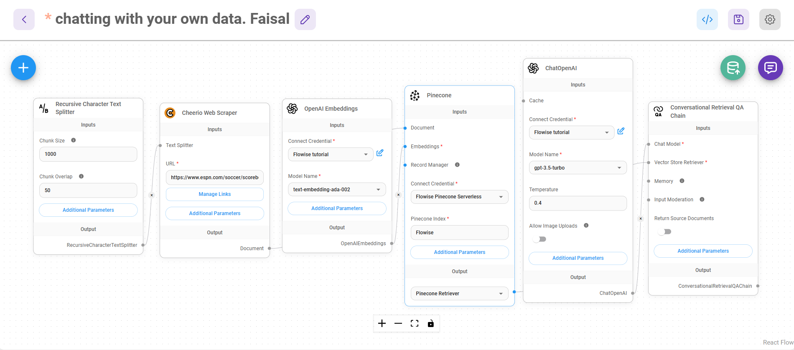
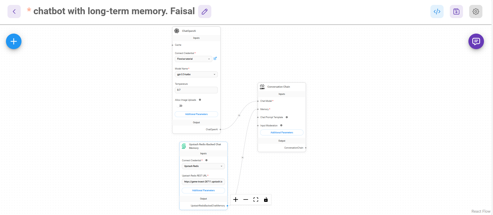
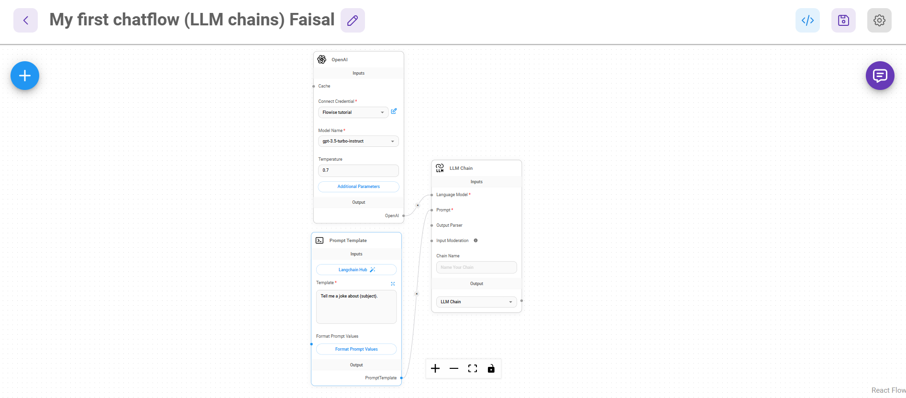
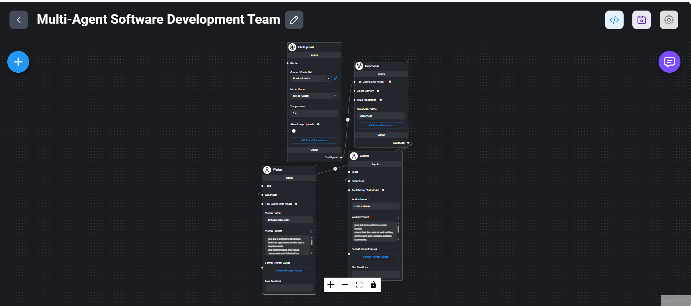
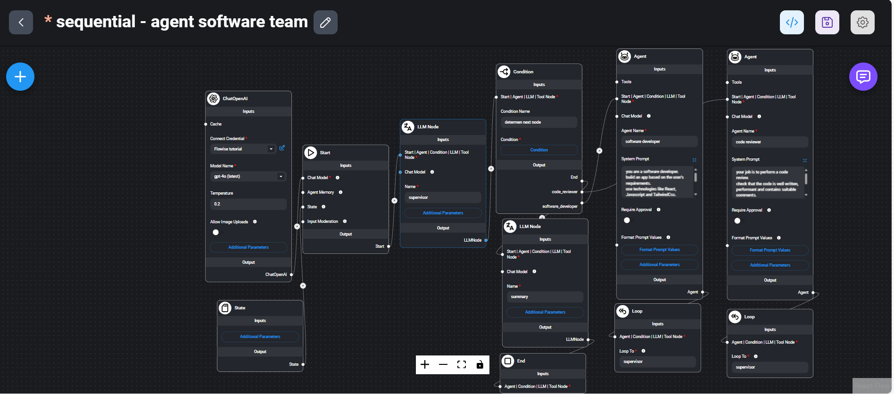
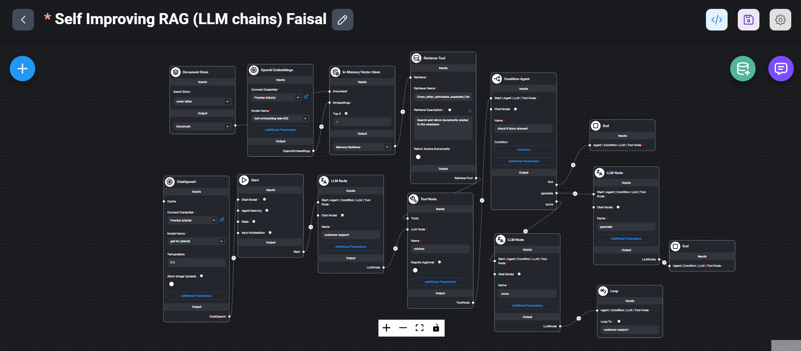
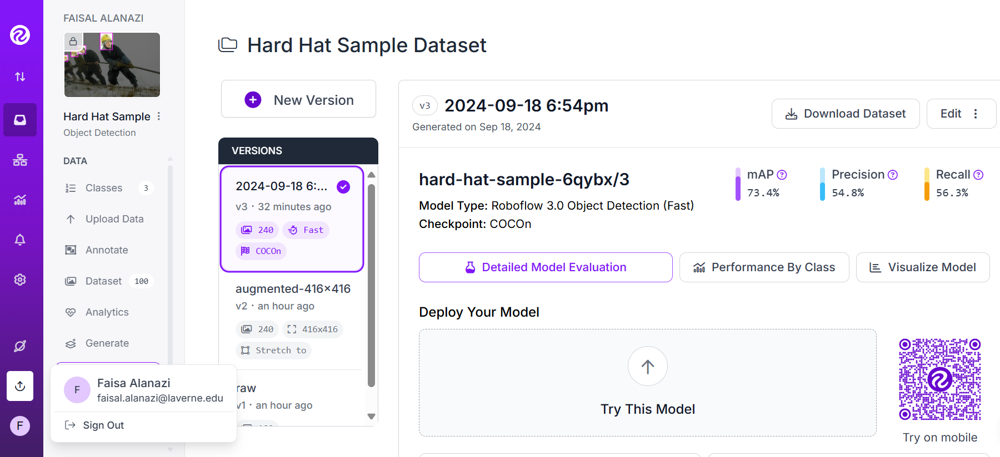

# AI Applications, RAG Systems & Agentic Workflows

## Project Overview

This repository contains a collection of AI application projects developed as part of advanced coursework and independent experimentation in large language models (LLMs), retrieval-augmented generation (RAG), agentic AI systems, conversational memory architectures, and computer vision.

The projects demonstrate practical applications of modern AI technologies for knowledge retrieval, workflow automation, software development assistance, conversational intelligence, and object detection.

---

# Technical Areas

- Large Language Models (LLMs)
- Retrieval-Augmented Generation (RAG)
- Agentic AI Systems
- Multi-Agent Workflows
- Long-Term Memory Systems
- Vector Databases
- Prompt Engineering
- Conversational AI
- Computer Vision
- Object Detection

---

# Project Portfolio

---

## 1. Retrieval-Augmented Generation (RAG) Chatbot

Built a chatbot capable of answering questions using external knowledge sources through document retrieval and vector embeddings.

### Technologies

- OpenAI
- Pinecone
- Embeddings
- Flowise
- Vector Search

### Skills Demonstrated

- Knowledge Retrieval
- Semantic Search
- AI Application Design

---

## 2. Long-Term Memory Chatbot

Developed a conversational AI system capable of maintaining memory across interactions using Redis-backed memory storage.

### Technologies

- OpenAI
- Redis
- Flowise
- Conversation Chains

### Skills Demonstrated

- Conversational AI
- Memory Management
- LLM Integration

---

## 3. LLM Chains

Designed modular prompt workflows that combine prompt templates and language models to automate structured tasks.

### Technologies

- OpenAI
- LangChain
- Flowise

### Skills Demonstrated

- Prompt Engineering
- Workflow Automation
- AI Pipeline Design

---

## 4. Multi-Agent Supervisor Architecture

Built a collaborative AI workflow where specialized agents perform different software development responsibilities under a supervisor agent.

### Technologies

- OpenAI
- Agent Frameworks
- Flowise

### Skills Demonstrated

- Agent Coordination
- Multi-Agent Systems
- Workflow Design

---

## 5. Sequential Multi-Agent Workflow

Created a sequential agent architecture that routes tasks through multiple specialized AI agents for software development and review processes.

### Skills Demonstrated

- Agent Orchestration
- Sequential Reasoning
- Workflow Automation

---

## 6. Self-Improving RAG System

Designed a RAG architecture capable of evaluating retrieved information and refining responses through iterative processing.

### Technologies

- OpenAI
- Embeddings
- Vector Databases
- Retrieval Systems

### Skills Demonstrated

- Advanced RAG Design
- AI Evaluation Workflows
- Retrieval Optimization

---

## 7. Computer Vision Object Detection

Developed an object detection model using labeled image datasets to identify safety equipment in construction-related environments.

### Technologies

- Roboflow
- Computer Vision
- Object Detection

### Skills Demonstrated

- Dataset Preparation
- Model Training
- Performance Evaluation

---

# Tools Used

- OpenAI
- LangChain
- Flowise
- Pinecone
- Redis
- Roboflow
- Vector Databases
- Prompt Engineering

---

# Key Takeaways

These projects strengthened practical experience in:

- Building AI-powered applications
- Designing retrieval systems
- Creating agent-based workflows
- Managing conversational memory
- Developing computer vision solutions
- Applying AI to real-world business problems
